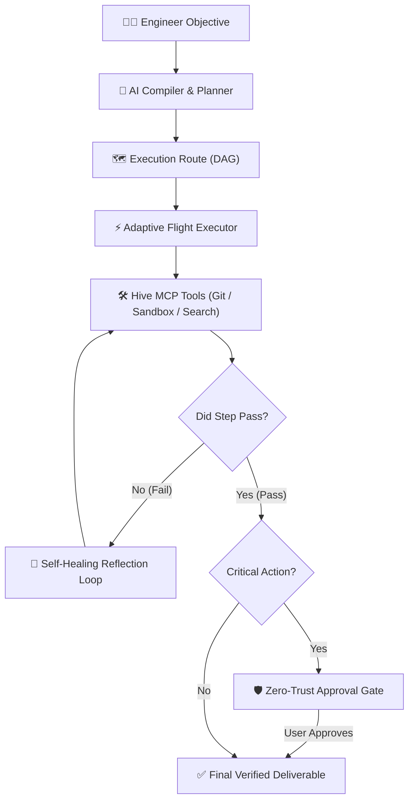
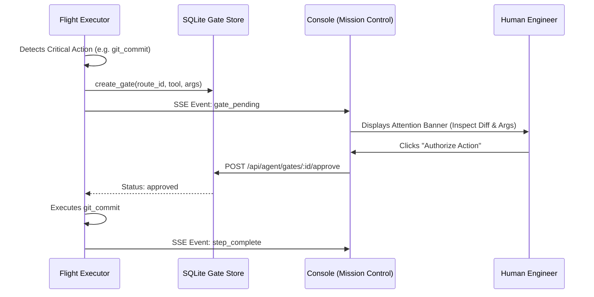
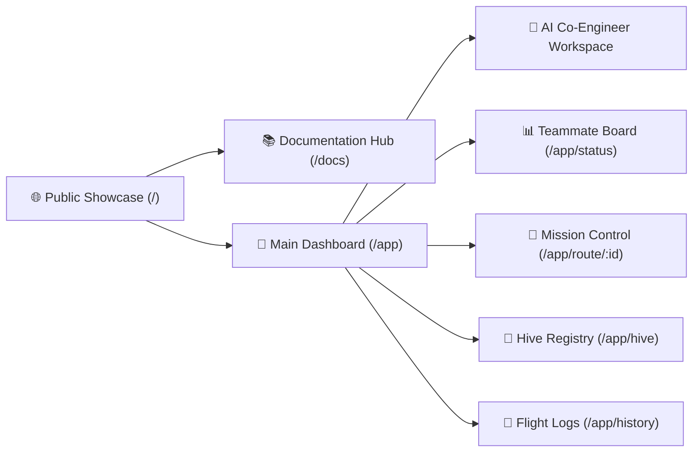
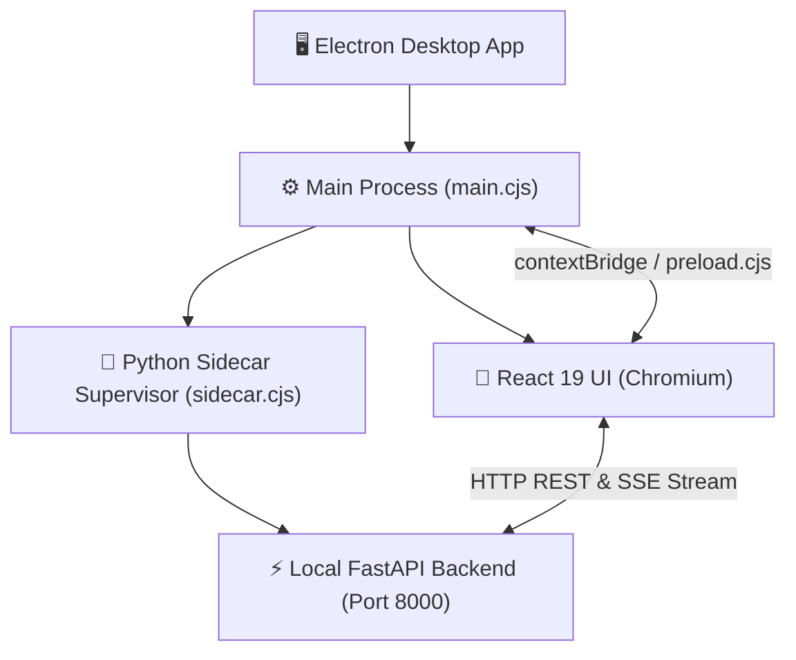

# BEE — Autonomous AI Co-Engineer Platform
## Comprehensive Technical & Architecture Overview

> **Version:** `0.1.0`  
> **Platform Support:** Windows (`.exe`), macOS (`.dmg`), Linux (`.AppImage`, `.deb`), Web Cloud  
> **Repository:** [https://github.com/Prince-695/bee](https://github.com/Prince-695/bee)  

---

## 1. Executive Summary

**Bee** is a state-of-the-art, open-architecture **Autonomous AI Co-Engineer** designed to act as an active, dependable software teammate for production engineering teams. Unlike simple code-completion chat assistants, Bee operates as an **execution-first agent**:

1. **Deterministic Planning:** Translates complex developer objectives into Directed Acyclic Graphs (DAGs) of discrete steps.
2. **Native Tool Integration (MCP):** Connects directly to local Git repositories, test sandboxes (pytest, vitest, cargo), ripgrep code indexers, and external SaaS connectors (GitHub, Slack, Jira, Postgres, Gmail).
3. **Adaptive Self-Healing Flight Loop:** Automatically diagnoses test and compilation failures, reflects on stack traces, and remediates code in real-time without human stalling.
4. **Zero-Trust Human Approval Gates:** Strictly halts and prompts for 1-click authorization before executing high-impact or destructive actions (`git_commit`, `git_push`, migrations).
5. **Cross-Platform Desktop & Cloud:** Available as a lightweight, supervised Electron desktop application across Windows, macOS, and Linux, as well as a containerized web platform.



---

## 2. Monorepo Architecture & Tech Stack

Bee is built inside a high-performance monorepo managed with **Turborepo** and **pnpm**:

```
bee/
├── apps/
│   ├── api/             # FastAPI Backend Gateway (Python 3.11+)
│   ├── console/         # React 19 Frontend + Electron Desktop Shell
│   ├── cli/             # Developer Terminal CLI interface
│   └── worker/          # Asynchronous Background Queue Worker
├── packages/
│   ├── api-client/      # Auto-generated TypeSafe TypeScript API Client
│   ├── ui/              # Shared UI component primitives & design tokens
│   └── python/
│       ├── bee-core/    # Execution Engine, Planning, Gates & State Stores
│       ├── bee-hive/    # Model Context Protocol (MCP) Server Registry
│       └── bee-logging/ # Distributed Structured JSONL Telemetry
├── tools/
│   └── hive-local/      # Standalone Stdio MCP Servers (Git, Sandbox, Search)
└── .github/
    └── workflows/       # CI Validation & Multi-Platform Release Pipelines
```

### Technology Matrix

| Layer | Technologies Used | Key Responsibilities |
| :--- | :--- | :--- |
| **Frontend UI** | React 19, TypeScript, Vite, Tailwind CSS, Lucide Icons, `@xyflow/react` | Teammate Board, Mission Control DAG visualizer, live streaming terminal, connector manager, documentation hub |
| **Desktop Shell** | Electron 44, `electron-builder` | Cross-platform desktop packaging (.exe, .dmg, .AppImage), system tray, native notifications, Python sidecar supervisor |
| **Backend Gateway** | FastAPI, Uvicorn, Pydantic v2, AnyIO | REST API endpoints, Server-Sent Events (SSE) streaming, route compilers, approval gate resolvers |
| **Agent Engine** | Python 3.11+, SQLite / `aiosqlite`, LiteLLM / OpenAI / NVIDIA API | DAG execution, self-healing reflection loops, durable state persistence, gate security checks |
| **Tool Layer (MCP)** | Model Context Protocol (`mcp`), Ripgrep, Subprocess Sandboxing | Git lifecycle tools, test & linter runner, AST code search, SaaS connectors |
| **CI / CD** | GitHub Actions | Matrix builds (Ubuntu, Windows, macOS), release publishing, ESLint, TypeScript verification |

---

## 3. Backend Engine Deep Dive (`apps/api` & `packages/python/`)

### 3.1 Adaptive Flight Execution & Self-Healing Loop
Located in `packages/python/bee-core/src/bee_core/executor/flight_executor.py`:
- When an objective is submitted, Bee generates an **Agent Route** containing ordered steps with explicit tool names and input arguments.
- Steps execute through the **Model Context Protocol (MCP)**.
- If a tool execution fails (e.g., exit code $\neq 0$ from a failing pytest/vitest assertion), Bee's **Adaptive Self-Healing Engine** engages:
  1. Captures the error payload, stderr, and failed assertions.
  2. Increments the step's retry counter (up to `MAX_RETRIES_PER_STEP = 2`).
  3. Dispatches a `self_heal_retry` event over SSE to notify the UI in real time.
  4. Injects error diagnosis prompts back into the LLM context.
  5. The LLM reflects on the failure, updates the code, and re-executes the sandbox test to verify the fix.

### 3.2 Zero-Trust Approval Gate Subsystem
Located in `packages/python/bee-core/src/bee_core/stores/gate_store.py`:
- To guarantee that an autonomous agent never makes unreviewed breaking changes, Bee classifies operations into **safe read operations** and **critical operations**:
  - `git_commit`, `git_push`, `git_create_branch`, `git_checkout`
  - Destructive file removals and shell commands
  - Database schema migrations
- When a critical tool is invoked, `flight_executor_helpers.py` intercepts the call:
  1. Creates an entry in the SQLite `approval_gates` table (`status = "pending"`).
  2. Dispatches a `gate_pending` event over SSE.
  3. Halts execution until the user reviews the exact arguments and authorizes the action via `POST /api/agent/gates/{gate_id}/approve` or rejects it via `POST /api/agent/gates/{gate_id}/reject`.



### 3.3 Engineering MCP Tool Servers
Located in `tools/hive-local/`:
1. **Git MCP Server (`git_mcp_server.py`)**:
   - `git_status`: Inspects branch status, staged files, untracked changes.
   - `git_diff`: Generates unified diffs of workspace changes.
   - `git_commit`: Commits staged changes with conventional messages.
   - `git_create_branch` & `git_checkout`: Manages task branch creation and isolation.
   - `git_log`: Inspects commit history.
2. **Sandbox Runner MCP Server (`sandbox_runner_mcp_server.py`)**:
   - `run_command`: Executes arbitrary commands with timeout and directory isolation.
   - `run_test_suite`: Auto-detects and runs `pytest`, `vitest`, `jest`, or `cargo test`.
   - `run_linter`: Runs linters (`ruff`, `eslint`, `flake8`) with structured line feedback.
   - `run_build`: Executes build pipelines (`pnpm build`, `tsc`, `cargo build`).
3. **Code Search MCP Server (`code_search_mcp_server.py`)**:
   - `code_ripgrep`: Ultra-fast regular expression symbol and string matching.
   - `code_find_files`: Glob-based file finding across repositories.
   - `code_view_file`: Safe line-range file content extraction.

---

## 4. Frontend & User Experience (`apps/console`)

### 4.1 OLED Cyber Design System
Bee features a custom **Dark OLED** design system built with CSS variables, high-contrast typography, custom glowing borders, and cyber scrollbars:
- Background: `#09090b` (Deep Obsidian).
- Accent Colors: Amber (`#f59e0b`), Emerald (`#10b981`), Cyber Blue (`#3b82f6`), Crimson (`#ef4444`).
- Responsive collapsible sidebar with active telemetry heartbeat and health status badges.

### 4.2 Page & Workspace Suite



1. **Public Showcase & Direct Downloads (`LandingPage.tsx`)**:
   - **Hero with OS Auto-Detection**: Detects whether the visitor is on Windows, macOS, or Linux and renders a 1-click **Direct Download** button triggering binary download immediately without redirecting away.
   - **Interactive Mission Control Simulator**: Live terminal simulation demonstrating route compilation, assertion failure diagnostics, and self-healing in real time.
   - **Architecture Visualizer**: Interactive 4-stage explanation of the Flight pipeline.
   - **Platform Matrix**: Dedicated cards for Windows (.exe), macOS (.dmg Universal), and Linux (.AppImage / .deb).

2. **Dedicated UI Documentation Hub (`DocsPage.tsx`)**:
   - Categorized sidebar with instant search filter.
   - Modules: *Quickstart & Desktop Install*, *Architecture & Self-Healing Loop*, *Hive MCP Tool Catalog*, *Zero-Trust Approval Gates*, *Building Custom MCP Servers*, and *REST & Streaming API Reference*.
   - Interactive code blocks with 1-click copy buttons.

3. **Teammate Board (`StatusPage.tsx`)**:
   - Executive telemetry metrics: Active Flights, Self-Healed Issues, Pending Approval Gates, Connected Tools.
   - Live Flight Stream with animated status pills, duration timers, and progress bars.
   - 1-click Autonomous Workflow Launchers (*"Fix Failing Tests"*, *"Review Pull Request"*, *"Run Security Linter"*, *"Index Codebase"*).
   - Real-time latency chart and streaming audit log.

4. **Mission Control DAG Visualizer (`RoutePage.tsx`)**:
   - Visual DAG node timeline with status glows (running pulse, completed emerald, error crimson, self-healing cyan, gate-pending blue).
   - **High-Priority Approval Gate Banner**: Elevated action card with 1-click **Authorize Action** (`POST /api/agent/gates/:id/approve`) and **Reject** controls.
   - **Split-View Streaming Terminal**: Auto-scrolling JetBrains Mono terminal logging real-time SSE tool dispatches and error traces.
   - **Step Parameter Inspector**: Detailed JSON inspect panel for tool inputs and outputs.

5. **Hive Connector Hub (`HivePage.tsx`)**:
   - Catalog grid for all MCP servers (Git, Sandbox, Code Search, GitHub, Slack, Jira, Postgres, Gmail, DuckDuckGo).
   - **User Connector Setup Modal**: Allows end users to configure their own SaaS tokens directly in the UI with local encrypted persistence, without modifying server `.env` files.

---

## 5. Cross-Platform Desktop Architecture (`electron/`)

Bee packages into a standalone desktop application on Windows, macOS, and Linux:



1. **Main Process (`main.cjs`)**:
   - Manages window lifecycle, frameless windows, custom titlebars, minimum dimensions (1024x700).
   - Manages System Tray integration with quick controls ("Open Mission Control", "Quit").
   - Dispatches native OS desktop notifications on Flight completion and Gate alerts.
2. **Preload API Context Bridge (`preload.cjs`)**:
   - Safely exposes `window.electronAPI` to React with methods for notifications, local directory selection dialogs, and window minimization/maximization.
3. **Supervised Python Sidecar (`sidecar.cjs`)**:
   - Automatically detects Python binary (`.venv`, `BEE_PYTHON_BIN`, or system Python).
   - Spawns the local FastAPI gateway (`bee_api.main:app`) as a child subprocess.
   - Polls `/api/health` until the API is online.
   - Guarantees clean, graceful process termination on window close or application exit.
4. **Multi-Platform Distribution Configuration (`apps/console/package.json`)**:
   - **Windows**: NSIS Installer (`Bee-Setup-0.1.0.exe`) & Portable (`Bee-0.1.0-portable.exe`).
   - **Linux**: AppImage standalone (`Bee-0.1.0.AppImage`) & Debian package (`bee_0.1.0_amd64.deb`).
   - **macOS**: Apple Silicon (`Bee-0.1.0-arm64.dmg`) & Intel (`Bee-0.1.0-x64.dmg`).

---

## 6. CI/CD & Automated GitHub Releases (`.github/workflows/`)

Bee includes an end-to-end automated release pipeline in `.github/workflows/release.yml`:
- **Triggers**: On tag push (`v*`) or manual `workflow_dispatch`.
- **Multi-Platform Matrix**:
  - `ubuntu-latest`: Builds Linux AppImage & Debian package.
  - `windows-latest`: Builds Windows NSIS Installer & Portable executable.
  - `macos-latest`: Builds macOS Apple Silicon & Intel `.dmg` images.
- **Publishing Step**: Uses `softprops/action-gh-release@v2` with `generate_release_notes: true` to automatically publish the official GitHub Release with changelogs, contributors, and all **11 compiled binary assets** attached.

---

## 7. Security, Privacy & Safety Model

1. **100% Local Workspace Privacy**:
   - AST code indexing, ripgrep searches, Git commands, and test sandbox executions run directly on the user's local filesystem without sending source code to third-party indexing clouds.
2. **Deterministic Human-in-the-Loop Safety**:
   - The Approval Gate subsystem strictly prevents autonomous agents from making unreviewed remote pushes, committing breaking changes, or modifying database schemas.
3. **Multi-Tenant User Isolation**:
   - In cloud mode, user connector credentials (GitHub tokens, Slack tokens) are isolated per-tenant in encrypted stores and are never exposed in shared server environments.

---

## 8. Directory & File Reference Map

```
/home/princerathod695/Projects/bee/
│
├── apps/
│   ├── api/                                  # FastAPI Application
│   │   ├── src/bee_api/
│   │   │   ├── main.py                       # Gateway Entrypoint, CORS & Routers
│   │   │   └── routers/
│   │   │       ├── router_agent.py           # /api/agent/route, /flight, /gates endpoints
│   │   │       ├── router_chats.py           # /api/chats history endpoints
│   │   │       ├── router_hive.py            # /api/hive/registry endpoints
│   │   │       └── router_logs.py            # /api/logs query & SSE stream endpoints
│   │   └── tests/                            # Pytest Unit Test Suite (13 tests)
│   │
│   └── console/                              # React 19 Frontend & Electron Desktop App
│       ├── electron/
│       │   ├── main.cjs                      # Electron Main Window & Tray Lifecycle
│       │   ├── preload.cjs                   # Safe contextBridge Desktop APIs
│       │   └── sidecar.cjs                   # Python Backend Process Supervisor
│       ├── src/
│       │   ├── App.tsx                       # Dashboard Layout, Nav & App Router
│       │   ├── index.css                     # Dark OLED Cyber Design Tokens
│       │   ├── lib/
│       │   │   ├── api.ts                    # TypeSafe API Client & SSE Stream Helper
│       │   │   └── downloads.ts              # OS Auto-Detection & 1-Click Direct Download Trigger
│       │   └── pages/
│       │       ├── LandingPage.tsx           # Public Showcase Website with Direct Downloads
│       │       ├── DocsPage.tsx              # Interactive UI Documentation Hub (/docs)
│       │       ├── StatusPage.tsx            # Teammate Board & Live Flight Stream
│       │       ├── RoutePage.tsx             # Mission Control DAG Visualizer & Streaming Terminal
│       │       ├── HivePage.tsx              # Hive MCP Registry & User Connector Setup
│       │       ├── ConversationPage.tsx      # AI Co-Engineer Chat Workspace
│       │       └── ChatHistoryPage.tsx       # Flight Log History & Inspection
│       └── package.json                      # Desktop Scripts & electron-builder Multiplatform Targets
│
├── packages/
│   ├── api-client/                           # OpenAPI Generated TypeScript Client
│   └── python/
│       ├── bee-core/                         # Agent Engine Core
│       │   └── src/bee_core/
│       │       ├── executor/
│       │       │   ├── flight_executor.py    # Adaptive Flight Loop with Self-Healing
│       │       │   ├── flight_executor_helpers.py # Critical Action & Gate Helpers
│       │       │   ├── prompts.py            # Route Compiler & Diagnosis Prompts
│       │       │   └── sse_stream.py         # Real-time SSE Dispatcher
│       │       └── stores/
│       │           ├── gate_store.py         # SQLite Zero-Trust Approval Gate Store
│       │           └── chat_store.py         # SQLite Chat & Route Session Persistence
│       ├── bee-hive/                         # MCP Registry Layer
│       └── bee-logging/                      # Structured JSONL Telemetry Logger
│
├── tools/
│   └── hive-local/
│       ├── git_mcp_server.py                 # Git Stdio MCP Server
│       ├── sandbox_runner_mcp_server.py      # Test, Linter & Build Runner Stdio MCP Server
│       └── code_search_mcp_server.py         # Ripgrep Regex Code Search Stdio MCP Server
│
└── .github/
    └── workflows/
        ├── ci.yml                            # CI Verification Pipeline
        └── release.yml                       # Multi-Platform GitHub Release Workflow
```

---

## 9. Verification & Quality Metrics

- **ESLint & TypeScript Typecheck:** Clean validation across all frontend, desktop, and documentation code (`pnpm lint`, `pnpm typecheck` $\rightarrow$ 0 errors, 0 warnings).
- **Production Bundle:** Full Vite optimization under `apps/console/dist/`.
- **Desktop Packaging:** Verified multi-platform binary generation generating `Bee-0.1.0.AppImage` (171 MB) and `bee_0.1.0_amd64.deb` (131 MB) locally, with `.exe` and `.dmg` matrix automation in GitHub Actions.
- **Backend Test Suite:** 13 unit tests verifying tool execution, error capture, and gate resolution lifecycles.

---

*Authored for the Bee Engineering Platform. Prepared for architectural evaluation, open-source documentation, and production deployment.*
