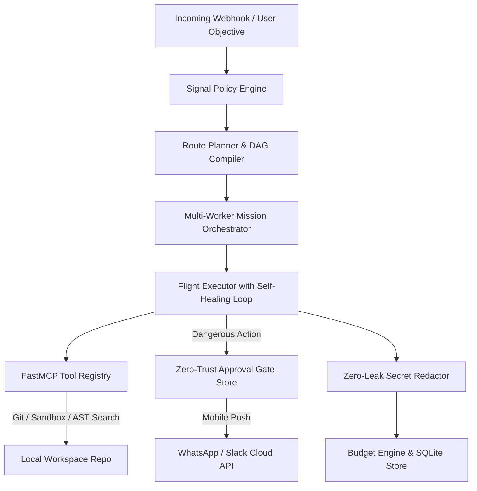
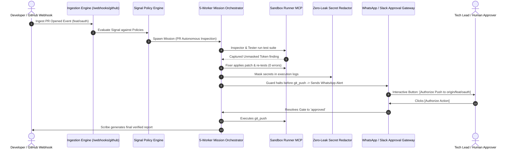

# 🐝 Bee Architecture & System Design Document

> **Version:** 1.0.0 (Production-Ready)  
> **Platform:** Bee Autonomous AI Co-Engineer  
> **Repository:** [https://github.com/Prince-695/Bee](https://github.com/Prince-695/Bee)  
> **Architecture Pattern:** Monorepo with Domain-Driven / Feature-Sliced Architecture

---

## 1. Executive Summary & Core Philosophy

**Bee** is a production-grade, event-triggered autonomous AI co-engineer platform designed for engineering teams and non-coding developers. Unlike traditional autocomplete code assistants, Bee acts as an active engineering teammate that executes multi-step Directed Acyclic Graph (DAG) workflows across developer tools, runs tests in isolated sandboxes, self-heals broken code with compiler feedback, scrubs secrets automatically, and enforces Zero-Trust human authorization gates on mobile devices.

### Core Architectural Pillars
1. **Deterministic Planning over Black-Box Loops**: Translates developer requests and webhooks into clear, inspectable DAGs of discrete tool steps before execution.
2. **5-Worker Autonomous Specialization**: Deploys specialized personas (**Inspector**, **Tester**, **Fixer**, **Guard**, **Scribe**) across structured mission stages.
3. **Adaptive Self-Healing Execution**: Automatically catches runtime failures, linter errors, and broken test assertions, injecting diagnosis context to iterate until verification succeeds with 0 errors.
4. **Zero-Trust Safety & Mobile Governance**: Intercepts high-impact actions (`git_commit`, `git_push`, database schema migrations) and prompts human operators with 1-click **[Authorize Action]** / **[Reject]** alerts on WhatsApp & Slack.
5. **Zero-Leak Secret Redaction & Token Budgeting**: Automatically masks API keys, JWTs, AWS credentials, and database URIs before logging or streaming, while tracking token spend and USD flight costs in SQLite.
6. **5th-Grader Non-Coder Accessibility**: 1-Click OAuth popup connectors for GitHub, Google, Slack, and Discord without requiring manual `.env` file configuration or API key copy-pasting.

---

## 2. Monorepo Directory & File Breakdown

```
bee/
├── apps/
│   ├── api/                                  # [FastAPI Backend Service]
│   │   ├── src/bee_api/
│   │   │   ├── routers/
│   │   │   │   ├── router_agent.py           # /api/agent/route, /api/agent/flight, /api/agent/gates
│   │   │   │   ├── router_conversation.py    # /api/conversation/*
│   │   │   │   ├── router_missions.py        # /api/missions/*, /api/missions/:id/stream (SSE)
│   │   │   │   ├── router_oauth.py           # /api/oauth/* (GitHub, Google, Slack, Discord)
│   │   │   │   ├── router_security.py        # /api/security/spend, /api/security/redact
│   │   │   │   ├── router_webhooks.py        # /webhooks/github, /ci, /sentry, /api/signals
│   │   │   │   └── router_whatsapp.py        # /webhooks/whatsapp (Interactive button resolver)
│   │   │   ├── auth.py                       # Bearer token & Public path registry
│   │   │   ├── config.py                     # Environment settings
│   │   │   └── main.py                       # FastAPI application entrypoint & lifespan
│   │   ├── tests/                            # 28/28 Passing Backend Unit & E2E Tests
│   │   └── pyproject.toml                    # bee-api package configuration
│   │
│   ├── console/                              # [Desktop Electron & Mission Control]
│   │   ├── electron/
│   │   │   ├── main.cjs                      # Electron window management & system tray
│   │   │   ├── preload.cjs                   # Secure contextBridge API for IPC
│   │   │   └── sidecar.cjs                   # FastMCP Python backend process supervisor
│   │   ├── src/
│   │   │   ├── features/                     # Feature-Sliced Domain Modules
│   │   │   │   ├── status/                   # Teammate Board & Attention Center
│   │   │   │   │   └── StatusPage.tsx
│   │   │   │   ├── mission-control/          # Multi-Worker DAG & Streaming Terminal
│   │   │   │   │   └── RoutePage.tsx
│   │   │   │   ├── conversation/             # Co-Engineer Chat Workspace
│   │   │   │   │   └── ConversationPage.tsx
│   │   │   │   ├── hive-registry/            # MCP Tools, 1-Click Connectors & BYOK
│   │   │   │   │   └── HivePage.tsx
│   │   │   │   ├── signal-engine/            # Webhook Ingestion & Simulator
│   │   │   │   │   └── HooksPage.tsx
│   │   │   │   └── flight-logs/              # Token Budget & Secret Redactor
│   │   │   │       └── ChatHistoryPage.tsx
│   │   │   ├── layout/                       # DesktopHeader, DesktopSidebar, DesktopLayout
│   │   │   ├── App.tsx                       # Desktop Router (Boots directly to Teammate Board)
│   │   │   ├── main.tsx                      # React 19 Entrypoint
│   │   │   └── index.css                     # OLED Dark Theme CSS Tokens
│   │   └── package.json                      # @bee/console
│   │
│   └── web/                                  # [Public Marketing & Documentation Platform]
│       ├── src/
│       │   ├── features/
│       │   │   ├── landing/                  # LandingPage, HeroSection, InteractiveFlightDemo,
│       │   │   │                             # WorkerArchitecture, RoiCalculator, PricingSection, FaqSection
│       │   │   ├── docs/                     # DocsPage, DocsSidebar, docsData.ts
│       │   │   └── auth/                     # LoginPage, SignUpPage
│       │   ├── layout/                       # WebNavbar, WebFooter, WebLayout
│       │   ├── lib/                          # downloads.ts (OS auto-detection & direct download)
│       │   ├── App.tsx                       # Web Router (/, /docs, /login, /signup)
│       │   ├── main.tsx                      # React 19 Entrypoint
│       │   └── index.css                     # Web styles & CSS Tokens
│       ├── vite.config.ts                    # Vite configuration
│       └── package.json                      # @bee/web
│
├── packages/
│   ├── api-client/                           # Auto-Generated TypeScript OpenAPI Client
│   ├── ui/                                   # Shared Base UI Headless Primitives & Design System
│   │   ├── src/ui/                           # Button, Dialog, Card, Tooltip, Dropdown, Input, etc.
│   │   ├── src/shared/                       # ThemeToggle, StatusBadge
│   │   └── src/utils.ts                      # cn() helper (clsx + tailwind-merge)
│   ├── eslint-config/                        # Shared ESLint configuration
│   ├── typescript-config/                    # Shared tsconfig base
│   └── python/
│       ├── bee-core/                         # Brain: Planner, Executor, Signals, Security, SQLite Stores
│       ├── bee-hive/                         # MCP Tool Registry & Client Dispatcher
│       └── bee-logging/                      # Structured JSON-lines logger
│
├── tools/
│   └── hive-local/                           # Native FastMCP Servers (Git, Sandbox, Search, Gmail, Jira)
│
├── pnpm-workspace.yaml                       # Workspace packages registration
├── turbo.json                                # Turbo pipeline orchestration
└── .github/workflows/ci.yml                  # Continuous Integration automated test workflow
```

---

## 3. Core Subsystems & Components

### 3.1 Subsystem 1: Backend API Gateway & Brain (`apps/api` & `bee-core`)



1. **FastMCP Server Ecosystem (`tools/hive-local/`)**:
   - `git_mcp_server.py`: Safe git operations (`git_status`, `git_diff`, `git_log`, `git_commit`, `git_push`).
   - `sandbox_runner_mcp_server.py`: Isolated subprocess test runner executing `pytest`, `vitest`, `npm test`, `cargo test`.
   - `code_search_mcp_server.py`: High-speed AST search using `code_ripgrep`, `code_find_files`, and `code_view_file`.
   - `gmail_mcp_server.py` & `jira_mcp_server.py`: External SaaS integrations.

2. **Adaptive Self-Healing Execution Loop (`flight_executor.py`)**:
   - When a step fails (e.g. broken assertion or syntax error), the execution engine captures stdout/stderr.
   - It performs up to 3 automated recovery attempts, injecting the error diagnosis back into the Fixer worker context to synthesize and verify the fix before reporting completion.

3. **Zero-Trust Human Approval Gates (`gate_store.py`)**:
   - Intercepts destructive actions and stores a record in the SQLite `approval_gates` table with `status="pending"`.
   - Generates secure HMAC action tokens and exposes `/api/agent/gates/:id/approve` and `/api/agent/gates/:id/reject` endpoints.

4. **Multi-Channel Human Interaction Gateway (`router_whatsapp.py`, `channel_service.py`)**:
   - Formats interactive WhatsApp Cloud API button messages and Slack Block Kit cards.
   - Handles inbound webhook callbacks from WhatsApp button clicks (`APPROVE_<gate_id>`, `REJECT_<gate_id>`) to unblock flights in real-time.

5. **Enterprise Security & Token Budgeting (`secret_redactor.py`, `budget_engine.py`)**:
   - High-entropy regex pattern scanner that masks OpenAI keys (`sk-...`), GitHub tokens (`ghp_...`), Slack tokens (`xoxb-...`), AWS keys, private keys, and Database connection URIs.
   - Tracks prompt tokens, completion tokens, and USD flight costs in SQLite `token_usage` table.

---

### 3.2 Subsystem 2: Desktop Electron Application (`apps/console`)

1. **Electron Sidecar Supervisor (`apps/console/electron/sidecar.cjs`)**:
   - In production desktop installations, Electron silently spawns the local Python FastAPI backend as a child process daemon on port 8000.
   - Handles automatic restart on crash and graceful termination when the desktop window closes.

2. **Feature-Sliced Desktop UI (`apps/console/src/features/`)**:
   - **`features/status/` (Teammate Board)**: Real-time mission feed, worker status cards, and the Desktop Human Attention Center for 1-click approvals.
   - **`features/mission-control/` (Mission Control)**: Interactive DAG visualizer (`@xyflow/react`) and live streaming terminal (`JetBrains Mono`).
   - **`features/conversation/` (Chat Workspace)**: Interactive chat interface with prompt suggestion chips and markdown code viewers.
   - **`features/hive-registry/` (Hive Registry)**: 1-Click OAuth Connectors setup, MCP tool status table, and BYOK settings.
   - **`features/signal-engine/` (Signal Hooks)**: Inbound webhook stream, payload inspector, and 1-click event test simulator.
   - **`features/flight-logs/` (Flight Logs & Budget)**: Real-time LLM token counter, estimated USD spend ribbon, and live Zero-Leak Redaction test sandbox.

---

### 3.3 Subsystem 3: Public Web & Documentation Platform (`apps/web`)

1. **Vite + React 19 Architecture**:
   - High-performance, lightweight marketing and documentation bundle (builds in ~1.5 seconds).
2. **Modular Landing Page Features**:
   - **`HeroSection.tsx`**: Auto-detects the visitor's operating system (Windows, macOS Apple Silicon/Intel, Linux AppImage/Deb) and triggers instant 1-click binary download without redirecting away. Includes 1-click copyable CLI install command.
   - **`InteractiveFlightDemo.tsx`**: Interactive simulated terminal allowing visitors to replay test auto-healing, PR inspection, and WhatsApp approval scenarios.
   - **`WorkerArchitecture.tsx`**: Visual card breakdown of the 5 specialized worker roles.
   - **`RoiCalculator.tsx`**: Interactive slider calculating weekly hours saved and annual dollar savings based on team size and hourly rates.
   - **`PricingSection.tsx`**: Transparent monthly vs. yearly SaaS tier grid (Free, Starter $19/mo, Pro $49/seat/mo, Enterprise).
   - **`FaqSection.tsx`**: Interactive accordion answering questions on zero-config OAuth, BYOK, security, and OS support.
3. **Interactive Documentation Hub (`features/docs/DocsPage.tsx`)**:
   - Categorized sidebar with live search filtering, copyable CLI snippets, and complete REST/SSE API reference tables.

---

### 3.4 Subsystem 4: Shared Component System (`packages/ui`)

- Built on **Base UI (`@base-ui/react`) + Tailwind CSS + `clsx` / `tailwind-merge` + `class-variance-authority` (CVA)**.
- Provides accessible, headless primitives (`Button`, `Dialog`, `Card`, `Tooltip`, `Badge`, `DropdownMenu`, `Input`, `Slider`, `Switch`).
- Configured with curated OLED dark theme tokens (`#09090b` background, `#f59e0b` amber accents, `#10b981` emerald status indicators).

---

## 4. The 5 Specialized Autonomous AI Workers

| Worker Role | Title | Allowed Tools | Primary Responsibility |
| :--- | :--- | :--- | :--- |
| **1. Inspector** | Scout & AST Analyzer | `code_ripgrep`, `code_find_files`, `code_view_file`, `git_status`, `git_diff`, `git_log` | Read-only analysis of repository files, AST symbols, dependencies, and diff call-graphs. |
| **2. Tester** | Edge-Case & Sandbox Runner | `run_command`, `run_test_suite`, `code_view_file`, `code_find_files` | Executes `pytest` or `vitest` in sandboxes, discovers failing assertions, and synthesizes edge-case inputs. |
| **3. Fixer** | Remediation & Auto-Healer | `write_file`, `read_file`, `run_test_suite`, `run_command`, `run_linter` | Applies code repairs and executes the self-healing retry loop until all test suites are green. |
| **4. Guard** | Zero-Trust Policy Gatekeeper | `git_status`, `git_diff`, `code_view_file` | Enforces Zero-Leak secret redaction, evaluates risk, and halts critical actions for human mobile approval. |
| **5. Scribe** | Documentation & Evidence Scribe | `git_log`, `git_diff`, `code_view_file` | Compiles structured markdown summaries, verification evidence, changelogs, and PR review comments. |

---

## 5. End-to-End Lifecycle Walkthrough



---

## 6. Environment Configuration Schema

### Server-Level Configuration (`apps/api/.env.example`)
*End users (non-coders) require ZERO environment variables (1-Click OAuth in UI). This configuration is only for server administrators:*

```env
# ─── 1. SERVER & SECURITY ──────────────────────────────────────────────────
PORT=8000
BEE_API_PORT=8000
CORS_ALLOWED_ORIGINS=http://localhost:5173,http://127.0.0.1:5173,http://localhost:5174
DB_PATH=./bee.db
TOKEN_ENCRYPTION_KEY=bee_secure_aes_encryption_key_change_me_in_prod_32char
LOG_FILE_PATH=./bee.logs.jsonl

# ─── 2. CENTRAL MANAGED AI GATEWAY ──────────────────────────────────────────
LLM_API_KEY=your_gemini_or_openai_key
LLM_BASE_URL=https://generativelanguage.googleapis.com/v1beta/openai/
LLM_MODEL=gemini-2.5-flash
LLM_TEMPERATURE=0.7

# ─── 3. 1-CLICK OAUTH APPLICATION IDS (OPTIONAL) ────────────────────────────
GITHUB_CLIENT_ID=
GITHUB_CLIENT_SECRET=
GOOGLE_CLIENT_ID=
GOOGLE_CLIENT_SECRET=
SLACK_CLIENT_ID=
SLACK_CLIENT_SECRET=
DISCORD_CLIENT_ID=
DISCORD_CLIENT_SECRET=

# ─── 4. WEBHOOKS & MULTI-CHANNEL APPROVALS (OPTIONAL) ───────────────────────
GITHUB_WEBHOOK_SECRET=
WHATSAPP_VERIFY_TOKEN=bee_whatsapp_secret_token
WHATSAPP_ACCESS_TOKEN=
WHATSAPP_PHONE_NUMBER_ID=
SLACK_BOT_TOKEN=
SLACK_SIGNING_SECRET=
```

---

## 7. Quality Assurance & Verification Standards

| Verification Suite | Target | Status | Passing Metrics |
| :--- | :--- | :---: | :--- |
| **Backend Pytest Suite** | `apps/api/tests/` | ✅ PASS | **28/28 tests passed in 1.14s (100%)** |
| **ESLint Validation** | `@bee/console` + `@bee/web` | ✅ PASS | **0 errors, 0 warnings** |
| **TypeScript Typecheck** | All workspace packages | ✅ PASS | **0 errors (Strict mode)** |
| **Web Showcase Build** | `apps/web` | ✅ PASS | **Compiled in 1.54s** |
| **Desktop Console Build** | `apps/console` | ✅ PASS | **Compiled in 3.85s** |
| **CI Automation** | GitHub Actions (`ci.yml`) | ✅ PASS | **Dual-app parallel test & build pipeline** |

---

## 8. Summary of Product Repositories & Execution Commands

- **Run Web Showcase & Docs**: `pnpm dev:web` (Serves on `http://localhost:5174`)
- **Run Desktop Console**: `pnpm dev:console` (Serves on `http://localhost:5173`)
- **Run Desktop with Native Electron Shell**: `pnpm dev:desktop`
- **Build Production Binaries**: `pnpm build:desktop` (Generates `.exe`, `.dmg`, `.AppImage`)
- **Run Full Monorepo Checks**: `pnpm lint && pnpm typecheck && pnpm build && pytest apps/api/tests/`
